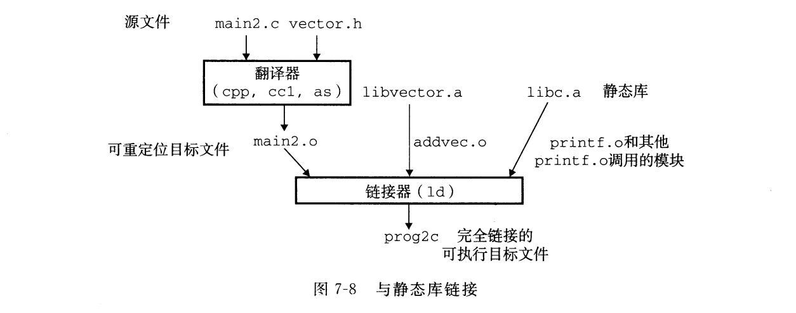
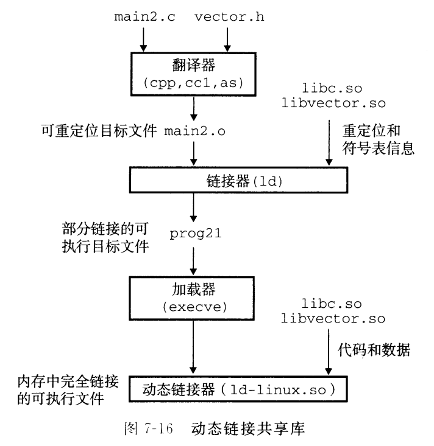

# 使用ar命令生成.a静态库

以下命令生成静态库
```shell
gcc -c addvec.c multvec.c
ar rcs libvector.a addvec.o multvec.o
```

以下命令使用静态库

```shell
gcc -c main2.c 
gcc -static -o prog2c main2.o ./libvector.a 
```



以下命令生成动态库

```shell
gcc --shared -fpic -o libvector.so addvec.c multvec.c
```



以下代码使用动态库
```shell
gcc -o prog21 main2.c ./libvector.so
```
